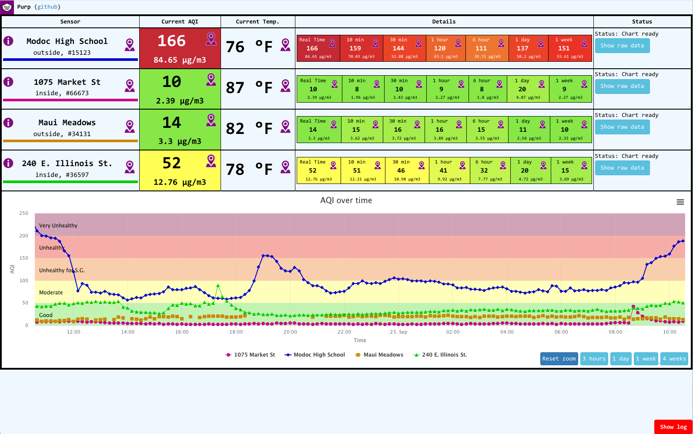

# Purp and PurpMap

Two projects here:
* Purp: Simple visualizer of PurpleAir data.
* PurpMap: Visualizer for PurpleAir changes over time on a map

## Purp

Written because I wanted to easily visualize multiple sensors on one, bookmarkable page.

And I wanted to learn Vue.js :)

### Purp: usage

To configure which sensors you want to see, add 
```
?show=sensor1,sensor2...
```
to the parameters.

#### Private sensors
If you want to access private sensors, just add 
```
&key=key1,key2...
```
to your url. 
Note, if some of your sensors don't need a key, use empty field between commas (but commas are needed).
For example, if `sensor1` and `sensor3` need a key, but `sensor2` does not,
use
```
index.html?show=sensor1,sensor2,sensor3&key=key1,,key3
```

### Purp: Example

Showing 4 sensors from various places in USA:

https://s3-us-west-1.amazonaws.com/marcin-pub/purp/index.html?show=15123,66673,34131,36597

Example screenshot: 

## PurpMap

This is a followup project, written as I wanted to see how air quality changes on the map

Hosted version: https://s3-us-west-1.amazonaws.com/marcin-pub/purp/purp-map.html

Example animation:


https://user-images.githubusercontent.com/4406638/135177845-0d5fbce8-d4dd-425d-838e-6a7bc8b5693d.mp4

